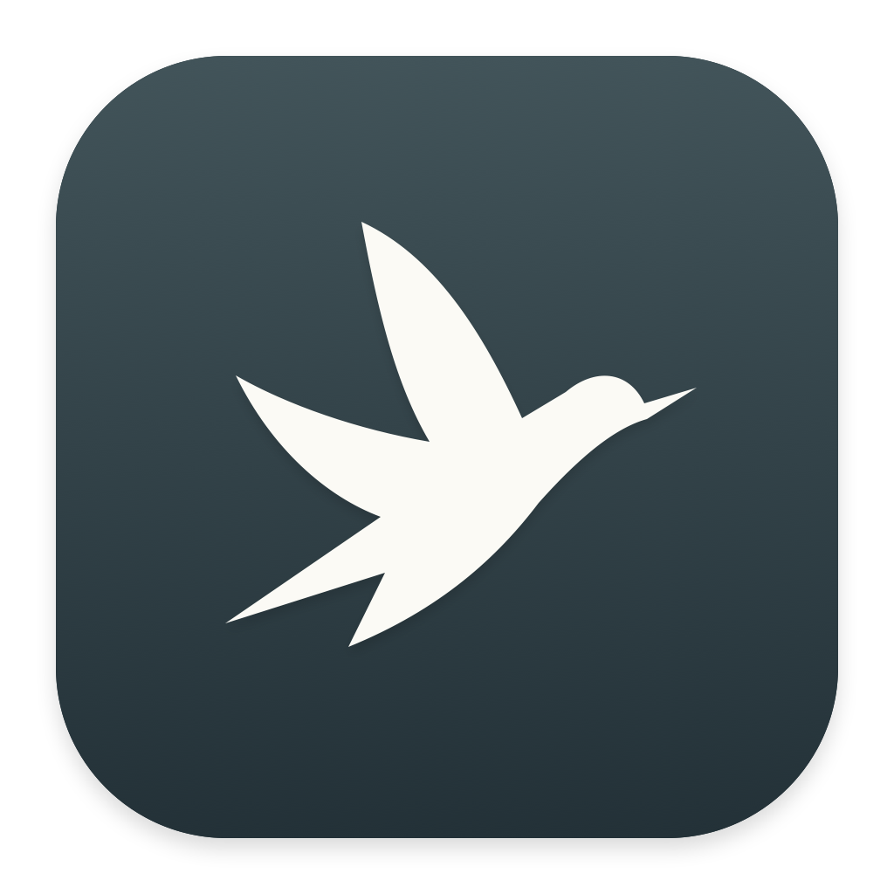

# Minimal Bird



A small Mac app for writing and posting to X. Your avatar, a composer, and a Post button. Feeds, notifications, engagement, trends, and profile browsing stay hidden.

Uses X's own website in Apple's WebKit. No paid API, API key, backend, analytics, or third-party dependencies. Independent software, not affiliated with X.

## Install and use

[Downloads and releases](https://github.com/Erik5000/minimal-bird/releases), or build it yourself below. To use a downloaded app, unzip it and move **Minimal Bird.app** into **Applications**. The current prebuilt app is an **experimental, ad-hoc-signed build**: it is not Developer ID signed or notarized, and macOS may block it after download. Building from source avoids depending on an unnotarized download. A notarized, straightforward installation is still pending.

Requires macOS 14 or newer. To build from source, install Xcode or a Swift 6 toolchain, then run:

```sh
git clone https://github.com/Erik5000/minimal-bird.git
cd minimal-bird
./scripts/build-app.sh
./scripts/install-app.sh
```

This creates **Minimal Bird.app** in **Applications**. Open it from Spotlight or Finder and drag its Dock icon into a permanent position if desired. For a user-only installation, run `./scripts/install-app.sh "$HOME/Applications"` instead.

Sign in with your X username/email and password and complete any verification X requests. X cookies stay in this app's WebKit store. Google/Apple sign-in, signup, and pop-out windows are unavailable in this version.

Write and attach images/video using the composer, then click **Post** yourself. X handles uploads, limits, account permissions, and submission. When X closes the composer after submission, the app shows a quiet finish screen. It does not independently verify publication or retrieve engagement.

- **⌘N:** New post.
- **⌘R:** Reload X; warns before discarding a detected draft.
- **⌘W / close button:** Hide the window while keeping the session and draft ready.
- **Dock icon / Window → Show Composer:** Reopen the window.
- **⌘Q:** Quit; warns about a detected draft.
- **⌘Z / ⇧⌘Z:** Undo / redo.
- **Options menu → Sign out:** Clear this app's cookies and website data.
- **Click your account name / Accounts menu:** Switch accounts or choose **Add account…**.
- **⌘1 through ⌘9:** Switch to one of the first nine saved accounts.

For multiple accounts, choose **Add account…** and sign in once in the new session. Each account uses a separate persistent WebKit store. Switching keeps previously opened composers warm and preserves their drafts while the app runs. Your original sign-in is retained, and the active handle appears in the window title when multiple accounts are saved. Sign out clears only the selected account's session; its menu slot can be used to sign in again. These sessions are independent of account switching in another browser. Account handles and store identifiers are saved locally in app preferences, outside the repository.

On quit, the app checks drafts in every opened account. Sessions survive relaunching; draft text does not. Keeping several accounts open uses more memory because each retains its own web view.

Window position and size are remembered. Drafts survive a hidden window but are not backed up across quitting or crashes.

The composer has a single warm background, a grouped avatar/account header, an uncluttered writing area, and a compact bottom toolbar with the Post button. Layout wrappers are styled with CSS; the live editor, upload input, and submission button keep their original DOM parents and X event handlers. New media previews remain part of the layout. The writing area receives keyboard focus when it opens and when you return from native menus or dialogs. Returning to a draft preserves its caret position. Clicking the blank writing area also returns to the editor.

Expanded authoring, such as threads, polls, and unfamiliar image-preview controls, falls back to X's own layout so additional fields and remove/cancel buttons remain visible. Use X's **Remove poll** control to return to writing; the post text is retained. The compact layout returns when the extra controls are removed. Feed and navigation isolation remain active.

Media selection uses X's original file input and the native Mac file chooser. Hidden upload inputs mounted outside the composer remain usable only through a composer action, while their surrounding page stays hidden and inert. Image previews and their removal controls remain available; cancelling the file chooser keeps the current composer.

You can also paste an image with **⌘V** into the composer or drop image/video files onto it. These actions deliver the files to X's original upload input and change handler. Plain text paste keeps its normal behavior. X remains responsible for accepted formats, attachment limits, processing, and submission.

Attachment detection includes images, videos, and previews painted as CSS backgrounds, even without known test IDs or removal buttons. Authoring with attachments uses X's original layout so its thumbnail rendering stays intact. Image paste/drop tests check that the PNG pixels decode and that thumbnails remain visible and removable.

## Loading and focus

The first opening after quitting still loads X's full web application and depends on X and your connection. Hiding its UI does not make its JavaScript bundle smaller.

While the app stays running, closing/reopening the window keeps the WebKit process and loaded assets. **New post** uses X's existing navigation when available, with a full-load fallback. The newer sign-in flow's composer modal is recognized in place, avoiding an unnecessary second load. The filter also reuses the recognized surface and changes keyboard isolation only when needed.

A document-start curtain hides the page until a recognized sign-in form or composer is present. Native navigation and client-side routes are restricted. Background elements are invisible and inert. Unknown layouts stay covered and show a retry screen. The core composer exposes media upload, polls, emoji, and reply controls where X supports them; browsing-oriented and scheduling controls are hidden. Reply settings and emoji pickers opened from the composer are recognized as separate authoring popups. Their search/selection controls remain available without revealing the surrounding page. Unknown advanced dialogs may still remain hidden.

This is visual and navigation isolation. X still makes its usual website requests and may download timeline data behind the curtain. The native app does not directly call private X APIs, inspect login-field values, store credentials itself, or add telemetry.

## Development

```sh
swift test --disable-sandbox
./scripts/build-app.sh
"build/Minimal Bird.app/Contents/MacOS/MinimalBird" --self-test
```

Unit tests check allowed and blocked URLs, including deceptive hosts, and account metadata persistence. WebKit tests use synthetic pages and a nonpersistent store, plus disposable persistent stores for cookie-isolation checks. They check composer/login visibility, background isolation, text/poll draft detection, resizing across avatar layout changes, the account-menu bridge, blocked navigation, dynamic page changes, completion, and warm reopening without a new document. A disposable PNG exercises the actual native file-input callback and FileReader access, external-input isolation, preview/removal controls, picker cancellation, and removal of a poll without losing text. They never publish or contact X. Run them in a normal macOS desktop session so WebKit can start its rendering process.

`--demo` opens the welcome screen without contacting X. `--diagnose` reports navigation paths, focus states, elapsed loading time, and surface counts. It omits URL queries, credentials, and post text. Do not commit diagnostic output or personal screenshots.

The live sign-in and composer were checked during development. Version 0.6.0 also checks restored typing/caret behavior after the account menu, reply settings, and emoji search, insertion, and dismissal. The 0.5.0 release candidate was checked against live X using the app icon: native image selection and image paste with ⌘V both displayed a preview, and removal restored the empty composer. The poll's removal control was checked against live X. Drag/drop is covered by WebKit fixtures; a Finder-to-X drag has not been manually verified. No post was published during these checks. Publication and account-specific media/verification flows require manual testing by the account owner. X can change its DOM or embedded-browser support; recognition rules live in `Sources/MinimalBird/Resources/focus.js`.

## Sharing and distribution

The repository contains source, the original icon generator and preview, tests, a macOS CI workflow, and the GNU GPL v3.0 license. Generated apps, build caches, logs, environment files, and local settings are ignored. Cookies and credentials are stored outside the repository by WebKit.

The default build produces a locally ad-hoc-signed app for personal use. Quit Minimal Bird before updating it; the installer verifies and replaces the complete bundle. This project does not include certificates, signing secrets, or an updater.

To prepare a release after committing changes, run `./scripts/package-release.sh`. It builds a universal app for Apple Silicon and Intel, runs the unit and WebKit checks, and writes the app ZIP, a source ZIP containing only committed files, and SHA-256 checksums into `build/releases/`. The binary has a macOS 14 minimum deployment target and is stripped of debug symbols. Source archives contain no Git metadata, local account preferences, WebKit sessions, or build caches. The binary ZIP is labeled `macos-local` until it passes the notarized distribution workflow. If sharing that build for testing, clearly identify it as experimental and not notarized; distribute its matching source ZIP and checksums alongside it.

For a notarized binary, install your own **Developer ID Application** certificate and store notarization credentials in a `notarytool` keychain profile. Then run:

```sh
export MINIMAL_BIRD_SIGNING_IDENTITY="Developer ID Application: Your Name (TEAMID)"
export MINIMAL_BIRD_NOTARY_PROFILE="your-notary-profile"
./scripts/package-release.sh --notarize
```

This enables hardened runtime and a signing timestamp, waits for notarization acceptance, staples the ticket, and checks Gatekeeper before producing the `macos` ZIP. Credentials stay in Keychain; keep certificates and passwords out of the repository. See [Apple’s notarization workflow](https://developer.apple.com/documentation/security/customizing-the-notarization-workflow).

See [CODE_REVIEW.md](CODE_REVIEW.md) for release findings and verification limits, and [CONTRIBUTING.md](CONTRIBUTING.md) for checks and privacy expectations.

## License

Copyright (c) 2026 Minimal Bird contributors. Licensed under the **GNU General Public License v3.0 only** (`GPL-3.0-only`); see [LICENSE](LICENSE).

You may use, study, modify, and share this software. If you distribute a modified version, it must remain under GPLv3 and recipients must receive the corresponding source under the license’s terms. Private modifications do not have to be published. Commercial use and charging for copies are allowed; GPL protects software freedom, not a zero price. There is no warranty.

## Acknowledgments

Thanks to [Search](https://github.com/driceroland/Search) by [Office Commun](https://officecommun.com/) for the inspiration: a small, focused Mac browser built with WebKit. Its approach helped shape the idea for Minimal Bird.

Minimal Bird is a separate AppKit application using Apple's `WKWebView` directly. It does not bundle Search or depend on its code. Please check out Search and support its contributors.
